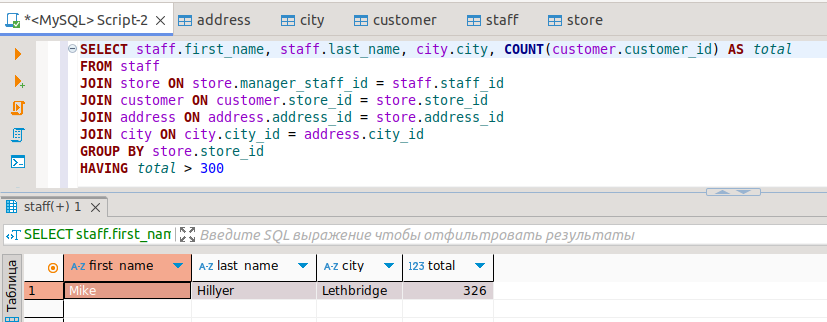
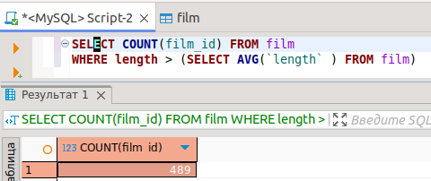
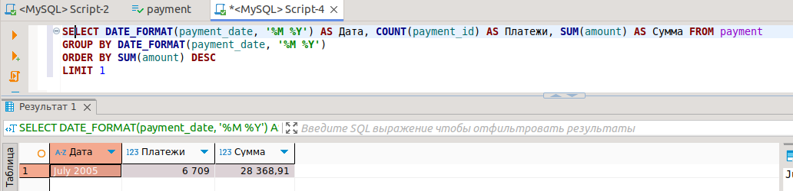

# Домашнее задание к занятию «SQL. Часть 2» - 'Жаринов Павел'
---
### Задание 1

Одним запросом получите информацию о магазине, в котором обслуживается более 300 покупателей, и выведите в результат следующую информацию: 
- фамилия и имя сотрудника из этого магазина;
- город нахождения магазина;
- количество пользователей, закреплённых в этом магазине.
```
SELECT staff.first_name, staff.last_name, city.city, COUNT(customer.customer_id) AS total
FROM staff
JOIN store ON store.manager_staff_id = staff.staff_id
JOIN customer ON customer.store_id = store.store_id 
JOIN address ON address.address_id = store.address_id
JOIN city ON city.city_id = address.city_id
GROUP BY store.store_id
HAVING total > 300 
```

### Задание 2

Получите количество фильмов, продолжительность которых больше средней продолжительности всех фильмов.
```
SELECT COUNT(film_id) FROM film
WHERE length > (SELECT AVG(`length` ) FROM film)
```

### Задание 3

Получите информацию, за какой месяц была получена наибольшая сумма платежей, и добавьте информацию по количеству аренд за этот месяц.
```
SELECT DATE_FORMAT(payment_date, '%M %Y') AS Дата, COUNT(payment_id) AS Платежи, SUM(amount) AS Сумма FROM payment
GROUP BY DATE_FORMAT(payment_date, '%M %Y')
ORDER BY SUM(amount) DESC
LIMIT 1
```

